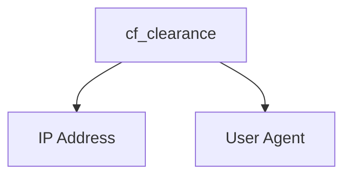

# CF-Clearance-Scraper

A simple program for scraping Cloudflare clearance (cf_clearance) cookies from websites issuing Cloudflare challenges to visitors. This program works on all Cloudflare challenge types (JavaScript, managed, and CAPTCHA).

> **Note**
This script currently will not be able to solve Cloudflare CAPTCHA challenges due to an issue with Playwright. For more information, see https://github.com/microsoft/playwright/issues/21780.

## Clearance Cookie Usage
In order to bypass Cloudflare challenges with the clearance cookies, you must make sure of two things:

- The user agent used to fetch the clearance cookie must match the user agent being used within the requests that use the clearance cookie
    > **Note**
    > The default user agent used by the scraper is `Mozilla/5.0 (Windows NT 10.0; Win64; x64; rv:109.0) Gecko/20100101 Firefox/109.0`
- The IP address used to fetch the clearance cookie must match the IP address being used to make the requests that use the clearance cookie



## Installation
    $ pip install -r requirements.txt
    $ python -m playwright install --with-deps firefox


## Usage
> **Note**
> Depending on the user agent used, it may affect your ability to solve the Cloudflare challenge

```
usage: main.py [-h] [-f FILE] [-t TIMEOUT] [-p PROXY] [-ua USER_AGENT] [--disable-http2] [--disable-http3] [-d] [-v] URL

A simple program for scraping Cloudflare clearance (cf_clearance) cookies from websites issuing Cloudflare challenges to visitors

positional arguments:
  URL                   The URL to scrape the Cloudflare clearance cookie from

options:
  -h, --help            show this help message and exit
  -f FILE, --file FILE  The file to write the Cloudflare clearance cookie information to, in JSON format
  -t TIMEOUT, --timeout TIMEOUT
                        The browser default timeout in seconds
  -p PROXY, --proxy PROXY
                        The proxy server URL to use for the browser requests (SOCKS5 proxy authentication is not supported)      
  -ua USER_AGENT, --user-agent USER_AGENT
                        The user agent to use for the browser requests
  --disable-http2       Disable the usage of HTTP/2 for the browser requests
  --disable-http3       Disable the usage of HTTP/3 for the browser requests
  -d, --debug           Run the browser in headed mode
  -v, --verbose         Increase the output verbosity
```

## Example
    $ python main.py -v -f cookies.json https://captcha.website
    [16:12:16] [INFO] Launching headless browser...
    [16:12:19] [INFO] Going to https://captcha.website...
    [16:12:20] [INFO] Solving Cloudflare challenge [CAPTCHA]...
    [16:12:24] [INFO] Cookie: cf_clearance=i5Yk2ZhJCi8lHinh_nl3lD__qCgUBYsXgPE8tSF0dN8-1678399942-0-250
    [16:12:24] [INFO] User agent: Mozilla/5.0 (Windows NT 10.0; Win64; x64; rv:109.0) Gecko/20100101 Firefox/109.0
    [16:12:24] [INFO] Writing Cloudflare clearance cookie information to cookies.json...