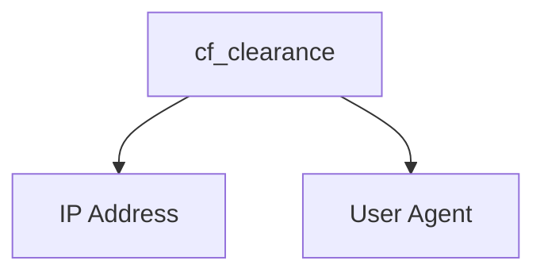

# CF-Clearance-Scraper

A simple program for scraping Cloudflare clearance (cf_clearance) cookies from websites issuing Cloudflare challenges to visitors. This program works on all Cloudflare challenge types (JavaScript, managed, and CAPTCHA).

## Clearance Cookie Usage
In order to bypass Cloudflare challenges with the clearance cookies, you must make sure of two things:

- The user agent used to fetch the clearance cookie must match the user agent being used within the requests that use the clearance cookie
    > **Note**
    > The default user agent used by the scraper is `Mozilla/5.0 (Windows NT 10.0; Win64; x64; rv:109.0) Gecko/20100101 Firefox/109.0`
- The IP address used to fetch the clearance cookie must match the IP address being used to make the requests that use the clearance cookie



## Installation
    $ pip install -r requirements.txt
    $ python -m playwright install --with-deps firefox


## Usage
> **Note**
> Depending on the user agent used, it may affect your ability to solve the Cloudflare challenge

```
usage: main.py [-h] -u URL [-f FILE] [-t TIMEOUT] [-p PROXY] [-ua USER_AGENT] [--disable-http2] [--disable-http3] [-d] [-v]

A simple program for scraping Cloudflare clearance (cf_clearance) cookies from websites issuing Cloudflare challenges to visitors

options:
  -h, --help            show this help message and exit
  -u URL, --url URL     Required argument for specifying the URL to fetch the Cloudflare clearance cookie from
  -f FILE, --file FILE  Optional argument for specifying the file to write the Cloudflare clearance cookie information to (in JSON format)   
  -t TIMEOUT, --timeout TIMEOUT
                        Optional argument for specifying the request timeout (in seconds)
  -p PROXY, --proxy PROXY
                        Optional argument for specifying the proxy server URL to use for requests (SOCKS5 proxy authentication not supported)
  -ua USER_AGENT, --user-agent USER_AGENT
                        Optional argument for specifying the user agent to use for requests
  --disable-http2       Optional argument for disabling HTTP/2 support for the browser
  --disable-http3       Optional argument for disabling HTTP/3 support for the browser
  -d, --debug           Optional argument for running the browser in headed mode
  -v, --verbose         Optional argument for increasing the output verbosity
```

## Example
    $ python main.py -u https://nowsecure.nl -f cookies.json -v