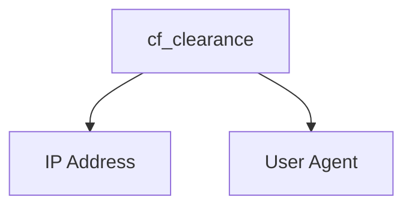

# CF-Clearance-Scraper

A simple program for fetching cf_clearance cookies from websites issuing cloudflare challenges to visitors. This program works on JavaScript and managed challenges. 

## Clearance Cookie Usage
In order to bypass cloudflare challenges with the clearance cookies, you must make sure of two things:

- The user agent used to fetch the clearance cookie must match the user agent being used within the requests that use the clearance cookie
    > **Note**
    > The default user agent used by the scraper is `Mozilla/5.0 (Windows NT 6.2; Win64; x64) AppleWebKit/605.1.15 (KHTML, like Gecko)`
- The IP address used to fetch the clearance cookie must match the IP address being used to make the requests that use the clearance cookie



## Installation

    $ pip install -r requirements.txt
    $ python -m playwright install --with-deps webkit


## Usage
> **Note**
> Depending on the user agent used, it may affect your ability to solve the cloudflare challenge

```
usage: main.py [-h] [-v] [-d] -u URL [-f FILE] [-t TIMEOUT] [-p PROXY] [-ua USER_AGENT]

Fetches cf_clearance cookies from websites issuing cloudflare challenges to visitors

options:
  -h, --help            show this help message and exit
  -v, --verbose         Increase output verbosity
  -d, --debug           Run the browser in headed mode
  -u URL, --url URL     URL to fetch cf_clearance cookie from
  -f FILE, --file FILE  File to write the cf_clearance cookie information to (JSON format)
  -t TIMEOUT, --timeout TIMEOUT
                        Request timeout (seconds)
  -p PROXY, --proxy PROXY
                        Proxy server to use for requests (SOCKS5 proxy authentication not supported)
  -ua USER_AGENT, --user-agent USER_AGENT
                        User agent to use for requests
```

```
Example: python main.py -u https://nowsecure.nl -f cookies.json -v
```