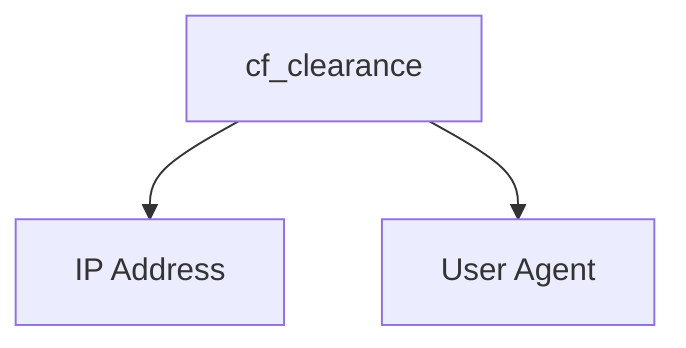

<div align="center">
  <a href="https://www.swiftproxy.net/?ref=Xewdy444">
    
  </a>
  <br>
  <strong>Swiftproxy</strong> — Premium residential proxies designed for Cloudflare-protected websites, browser automation, and web scraping. <strong>Access 80M+ residential IPs across 190+ countries</strong> with rotating and sticky sessions, <strong>HTTP/HTTPS/SOCKS5</strong> support, non-expiring traffic, and reliable connections for large-scale automation and data collection.
  <br><br>
  <strong> 🎁 Free trial available <br> 🏷️ 10% OFF with code: PROXY90 </strong>
  <br><br>
  <strong>Link</strong>: https://www.swiftproxy.net/?ref=Xewdy444
</div>

---

# CF-Clearance-Scraper
A simple program for scraping Cloudflare clearance (cf_clearance) cookies from websites issuing Cloudflare challenges to visitors. This program works on all Cloudflare challenge types (JavaScript, managed, and interactive).

## Clearance Cookie Usage
In order to bypass Cloudflare challenges with the clearance cookies, you must make sure of two things:

- The user agent used to fetch the clearance cookie must match the user agent being used within the requests that use the clearance cookie
- The IP address used to fetch the clearance cookie must match the IP address being used to make the requests that use the clearance cookie


```mermaid
flowchart
	N14e["cf_clearance"]
	N14f["IP Address"]
	N150["User Agent"]
	N14e --> N14f
	N14e --> N150
```

## Installation
Download and install [Google Chrome](https://www.google.com/chrome/index.html).

Then, install the Python dependencies:

    $ pip install -r requirements.txt

## Usage
> [!WARNING]
> Depending on the user agent used, it may affect your ability to solve the Cloudflare challenge.

```
usage: main.py [-h] [-f FILE] [-t TIMEOUT] [-p PROXY] [-ua USER_AGENT] [--disable-http2] [--disable-http3] [--headed] [-ac] [-c] [-w] [-a] URL

A simple program for scraping Cloudflare clearance (cf_clearance) cookies from websites issuing Cloudflare challenges to visitors

positional arguments:
  URL                   The URL to scrape the Cloudflare clearance cookie from

options:
  -h, --help            show this help message and exit
  -f FILE, --file FILE  The file to write the Cloudflare clearance cookie information to, in JSON format
  -t TIMEOUT, --timeout TIMEOUT
                        The timeout in seconds to use for solving challenges
  -p PROXY, --proxy PROXY
                        The proxy server URL to use for the browser requests
  -ua USER_AGENT, --user-agent USER_AGENT
                        The user agent to use for the browser requests
  --disable-http2       Disable the usage of HTTP/2 for the browser requests
  --disable-http3       Disable the usage of HTTP/3 for the browser requests
  --headed              Run the browser in headed mode
  -ac, --all-cookies    Retrieve all cookies from the page, not just the Cloudflare clearance cookie
  -c, --curl            Get the cURL command for the request with the cookies and user agent
  -w, --wget            Get the Wget command for the request with the cookies and user agent
  -a, --aria2           Get the aria2 command for the request with the cookies and user agent
```

## Example
    $ python main.py -f cookies.json https://sergiodemo.com/security/challenge/legacy-challenge
    [14:24:27] [INFO] Launching headless browser...
    [14:24:27] [INFO] Going to https://sergiodemo.com/security/challenge/legacy-challenge...
    [14:24:28] [INFO] Solving Cloudflare challenge [Interactive]...
    [14:24:31] [INFO] Cookie: cf_clearance=SkyEdEGvKp1BBA2NpRW3Azsw5neMD6sEEqJd6jOCCfs-1736886257-1.2.1.1-cam47ywp3q_yKE1bw0lZ2YS83dnh_BsIHtS7earbsYE.AxQDBtZiifiHvp1nZGRhABaSdjU7XRQpUCVwUSrlJGH8DXr50YR18pNLxBvcEJFO2gPMxr.ZjKze8rWgM9H4rPeET67jzAo_ZRpNP6hGCvdyO62VVCtqDBQDKhKZz9yZQp7YEHK7tchQIteVgu.dUxYdan5_D.R0zewnS382BP0w1AoTf2p40.lQwbhgildEiKG14xACd13V4EEthkZV0dnliwcn35rT3h32ODf50MABQNSQ8WjhZhbLSNOPO_zEhrK9R0Yn4eBuRKvnL9_x9jKvaBPDPAgyiZv_VzFP_g
    [14:24:31] [INFO] User agent: Mozilla/5.0 (Windows NT 10.0; Win64; x64) AppleWebKit/537.36 (KHTML, like Gecko) Chrome/133.0.0.0 Safari/537.36
    [14:24:31] [INFO] Writing Cloudflare clearance cookie information to cookies.json...
