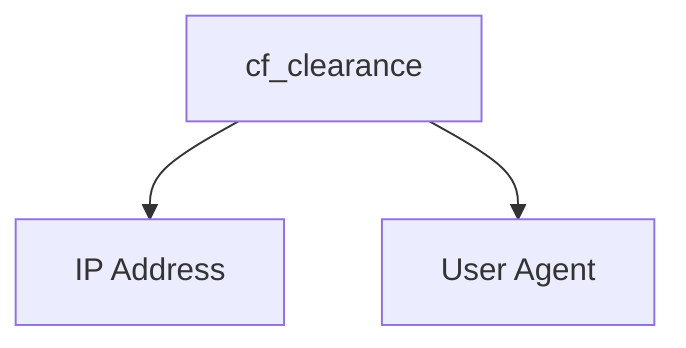

# CF-Clearance-Scraper

## Playwright Version
A simple program for scraping Cloudflare clearance (cf_clearance) cookies from websites issuing Cloudflare challenges to visitors. This program works on all Cloudflare challenge types (JavaScript, managed, and interactive). If you would prefer using nodriver, you can check out the [nodriver version](https://github.com/Xewdy444/CF-Clearance-Scraper/tree/nodriver).

## Clearance Cookie Usage
In order to bypass Cloudflare challenges with the clearance cookies, you must make sure of two things:

- The user agent used to fetch the clearance cookie must match the user agent being used within the requests that use the clearance cookie
> [!NOTE]
> The default user agent used by the scraper is `Mozilla/5.0 (Windows NT 10.0; Win64; x64) AppleWebKit/537.36 (KHTML, like Gecko) Chrome/130.0.0.0 Safari/537.36`.
- The IP address used to fetch the clearance cookie must match the IP address being used to make the requests that use the clearance cookie


```mermaid
flowchart
	N14e["cf_clearance"]
	N14f["IP Address"]
	N150["User Agent"]
	N14e --> N14f
	N14e --> N150
```

## Installation

    $ pip install -r requirements.txt
    $ python -m patchright install chromium


## Usage
> [!NOTE]
> Depending on the user agent used, it may affect your ability to solve the Cloudflare challenge.

```
usage: main.py [-h] [-f FILE] [-t TIMEOUT] [-p PROXY] [-ua USER_AGENT] [--disable-http2] [--disable-http3] [-d] [-v] URL

A simple program for scraping Cloudflare clearance (cf_clearance) cookies from websites issuing Cloudflare challenges to visitors

positional arguments:
  URL                   The URL to scrape the Cloudflare clearance cookie from

options:
  -h, --help            show this help message and exit
  -f FILE, --file FILE  The file to write the Cloudflare clearance cookie information to, in JSON format
  -t TIMEOUT, --timeout TIMEOUT
                        The timeout in seconds to use for browser actions and solving challenges
  -p PROXY, --proxy PROXY
                        The proxy server URL to use for the browser requests (SOCKS5 proxy authentication is not supported)
  -ua USER_AGENT, --user-agent USER_AGENT
                        The user agent to use for the browser requests
  --disable-http2       Disable the usage of HTTP/2 for the browser requests
  --disable-http3       Disable the usage of HTTP/3 for the browser requests
  -d, --debug           Run the browser in headed mode
  -v, --verbose         Increase the output verbosity
```

## Example
    $ python main.py -v -f cookies.json https://sergiodemo.com/security/challenge/legacy-challenge 
    [13:36:22] [INFO] Launching headless browser...
    [13:36:22] [INFO] Going to https://sergiodemo.com/security/challenge/legacy-challenge...
    [13:36:23] [INFO] Solving Cloudflare challenge [Interactive]...
    [13:36:25] [INFO] Cookie: cf_clearance=p9G62bGyQSCbZQEooPmXGXiibj7D7vtd6WijZ2ZPQdk-1733513777-1.2.1.1-olBJqsOO23SaLjelD03BE67Fr8Vm0fNWdc.skbcS8D.OWT4kcHJSTM8Tr1inDeSBFKQWxHZrShKR43Ml0gN1mvFHS7erZeQdoRYjwMDSHoYotG2.EvpuHWIyz0z7CoclXBIuSpM6kzvuKKm3bY0bhv5Sbl9IMnP08660bHEsPSS8JZTxLAsmmdHcnEU20nSbh1PuZaye_pmyrtbFGgDcd9uEntuocj55_WSx4BQfjJnj.8gz6w9bZ1BWQJFYrysoVD9LDQczl6FosYWc_hbmDz1s5nHgooQGGkSOWjsZrf84JvlXQ85PGEE1nTINe_gLm_vgZLBXAJS32DAgR0.vhctysUuKR3SosY9T_696hgDITz37g_kU_ZJlOD1S2KAug_uwHgsiRpHUxR7jTiHUQ_Fh6v453UrRPMkNZGctGC4
    [13:36:25] [INFO] User agent: Mozilla/5.0 (Windows NT 10.0; Win64; x64) AppleWebKit/537.36 (KHTML, like Gecko) Chrome/130.0.0.0 Safari/537.36
    [13:36:25] [INFO] Writing Cloudflare clearance cookie information to cookies.json...
